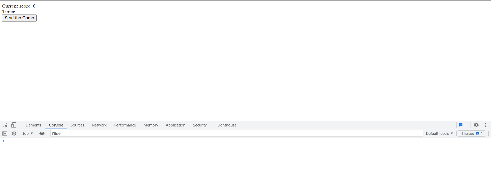
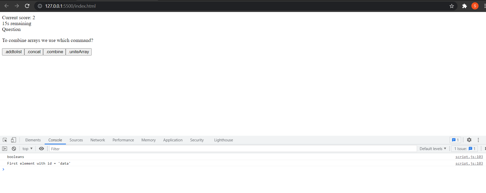
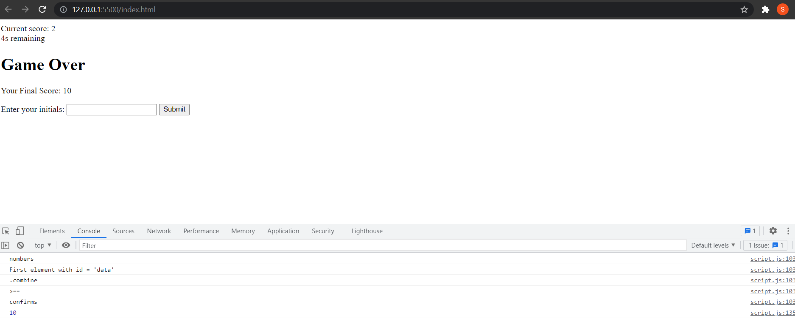
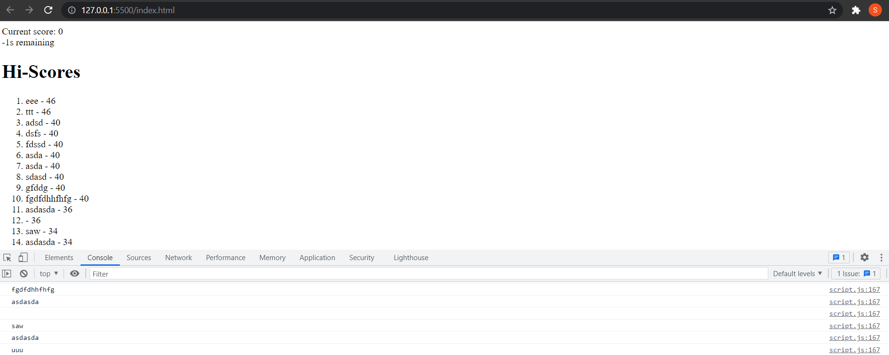

# Javaquiz
For this assignment I dived into the world of javascript, manipulating hmtl elements, using local storage, the whole nine yards.

I created a short quiz of five questions, the player has 25 seconds to answer all of the questions. The game is over when the player has answered all five questions, or the timer reaches 0. Players are able to record their scores and view them whenever they visit the page from the same machine.

# The Application
It doesn't look great, it's basic, but it works. 

When the user answers they awarded 2 points if they selected the correct answer
if the player picked an incorrect answer 5 seconds is deducted from the timer
at the end of the game a player is awarded any spare time on the counter to their score

# The big takeaways.
Like last week formatting really bit me. I got carried away and needed some major assistance sorting my code out into its functional pieces. It worked better, was easier to modify. It was awesome.

I need to make more note of how things are formated specifically with functions and methods.